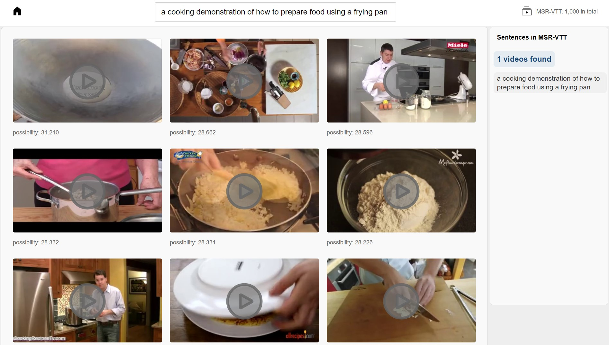
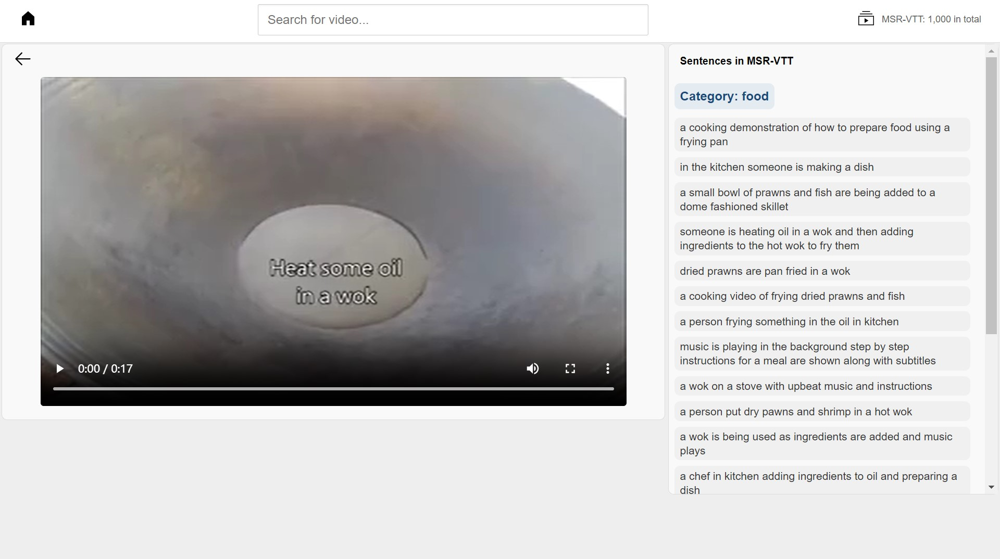
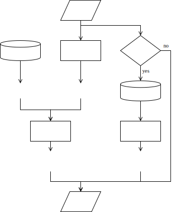

# 毕业设计：《基于CLIP模型的视频文本检索设计与实现》

###  主要内容
针对现有基于CLIP预训练模型方法存在的训练时间长、模型规模大等问题，本文在CLIP4Clip模型的基础上，采用关键帧保存方案和Adapter Tuning低参数量微调，提高了计算资源有限情况下的训练效率和模型性能。
1. 训练速度方面，本文首先采用帧保存方案，将视频库中的关键帧提取并保存为图片，从而加快数据加载速度，将训练速度提高了14.6倍；然后采用AIM模型的Adapter设计方案，在CLIP4Clip模型中插入可训练的Adapter层，只训练少量参数实现快速收敛，最终实现训练速度提高34倍。
2. 模型性能方面，论文证明了平均选取视频关键帧，比按照最大帧间差选取视频关键帧的效果更优；然后证明了AIM在视频检索领域的有效性；并可以使用AIM来提高模型性能，将模型在MSR-VTT数据集上的R@1从42.2%提升至43.4%，R@5从70.2%提升为71.1%。
3. 本文设计并实现了一个视频文本检索系统，为了保障系统的检索速度，搭建了向量数据库，并测试了不同数据保存方式的数据存取速度。系统使用Django搭建了Web端应用，实现了多种功能需求，展示了本文方法在视频文本检索系统中的应用效果和潜力。

关键词：视频文本检索；CLIP模型；CLIP4Clip模型；低参数量微调；训练加速

### 技术实现
1. 模型基于[CLIP](https://github.com/openai/CLIP)、[CLIP4Clip](https://github.com/ArrowLuo/CLIP4Clip)、[AIM](https://github.com/taoyang1122/adapt-image-models)，数据集主要使用[MSR-VTT](http://ms-multimedia-challenge.com/2017/dataset)；
2. 界面后端由Django实现；
### 图片

    
     
    

    检索结果展示页面
  	

    
     
    

    视频播放页面
  	

    
     
    

    用户搜索视频流程图
  	

    
     
    

      算法整体结构
  	

    
     
    

    模型整体结构
  	

